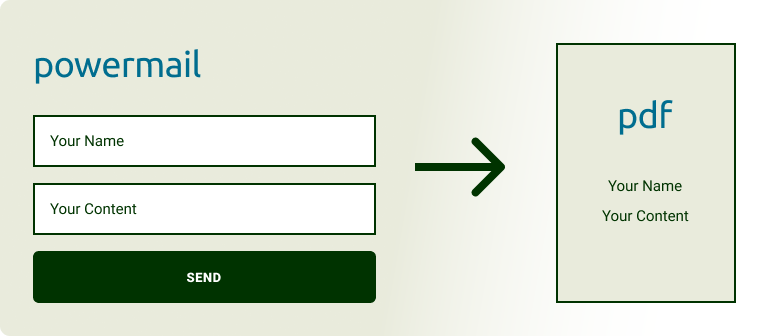

.. include:: ../Includes.txt

.. _introduction:

What does it do?
================

The **TYPO3 extension PowermailPdf** converts form data into a PDF document. After submitting the form, the PDF can be downloaded or attached to and email.
The PDF document needs to have writeable fields where the data can map into. This extension provides a sample.pdf for testing

The TYPO3 extension **PowermailPdf** extends the `TYPO3 extension Powermail
<https://extensions.typo3.org/extension/powermail/>`_.

.. _screenshots:

Screenshot
===========

